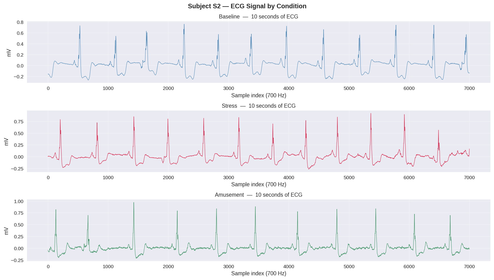

# Stress Detection from Physiological Signals

A deep learning project that classifies stress levels from 
wearable biosignal data using LSTM neural networks.

Built as a portfolio project to demonstrate end-to-end ML 
engineering — from raw sensor data to trained model.

---

## Demo

> Training in progress — demo video coming soon.



---

## Problem

Stress is a major driver of physical and mental health issues, 
yet most people have no objective way to measure it. Wearable 
sensors capture physiological signals that change measurably 
under stress. This project builds a model that learns those 
patterns automatically.

**Goal:** Given 60 seconds of chest sensor data (ECG, EDA, EMG, 
Temperature), classify the user's state as one of:
`Baseline · Stress · Amusement · Meditation`

---

## Dataset

**WESAD** (Wearable Stress and Affect Detection)  
Philip Schmidt et al., ACM ICMI 2018  
14 subjects · chest + wrist sensors · lab-controlled conditions  
→ [Dataset info](https://archive.ics.uci.edu/dataset/465/wesad)

*Dataset not included in repo due to size (~1.7 GB). 
See `data/README.md` for download instructions.*

---

## Architecture

```
Input: (batch, 42000, 4)     ← 60s × 700Hz × 4 signals
         ↓
LSTM Layer 1  (128 units, dropout 0.3)
         ↓
LSTM Layer 2  (64 units,  dropout 0.3)
         ↓
Linear Layer  (64 → 4)
         ↓
Output: 4-class softmax      ← Baseline / Stress / Amusement / Meditation
```

---

## Results

> In progress — will update with final metrics.

| Metric | Score |
|--------|-------|
| Accuracy | TBD |
| Stress F1 | TBD |
| Macro F1 | TBD |

---

## Project Structure

```
stress-detection/
├── data/
│   ├── processed/       ← windowed numpy arrays (gitignored)
│   └── README.md        ← dataset download instructions
├── notebooks/
│   ├── 01_data_exploration.ipynb
│   ├── 02_preprocessing.ipynb
│   └── 03_model_training.ipynb  ← coming soon
├── src/                 ← modular scripts (coming soon)
├── outputs/             ← plots and figures
├── requirements.txt
└── README.md
```

---

## Setup

```bash
git clone https://github.com/YOUR_USERNAME/stress-detection.git
cd stress-detection
python -m venv .venv
source .venv/bin/activate
pip install -r requirements.txt
```

Then download the WESAD dataset (see `data/README.md`) and run 
notebooks in order.

---

## Tech Stack

- **Python 3.12** · PyTorch · NumPy · pandas
- **Model:** Stacked LSTM
- **Environment:** Linux Mint 22 (native)
- **Experiment tracking:** coming soon (Weights & Biases)

---

# Dataset Download Instructions

This project uses the **WESAD** dataset.

1. Go to: https://uni-siegen.sciebo.de/s/HGdUkoNlW1Uc0Ah
2. Fill in the access form (name + institution)
3. Download `WESAD.zip` (~1.7 GB)
4. Extract into the project root:

```bash
unzip WESAD.zip -d ~/stress-detection/
```
